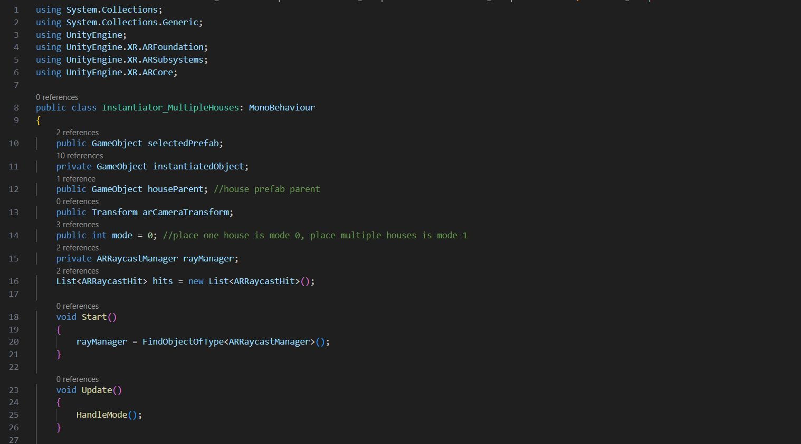

# ARC596 - Tutorial 4 - Multiple Houses

- ARC596: Embodied Computation
- Professor: Daniela Mitterberger - mitterberger@princeton.edu
- Assistant Instructor: Kirill Volchinskiy - kvolchinskiy@princeton.edu

### Requirements

1. [Rhinoceros 7](https://www.rhino3d.com/en/7/)
2. [Github Desktop](https://desktop.github.com/) 
3. [Anaconda](https://www.anaconda.com/)
4. [Unity 2022.3.3f1](https://unity.com/) 
>	*Note: Android SDK and Java JDK (when developing for Android) - have to be ticked in the installation modules when installing Unity.*

### Dependencies

1. [COMPAS](https://compas.dev)
2. [COMPAS Fab - Fabrication Library for Robots](https://gramaziokohler.github.io/compas_fab/latest/)
3. [COMPAS Eve - Communication](https://compas.dev/compas_eve/latest/index.html)
4. [Vuforia](https://developer.vuforia.com/downloads/sdk)
5. [ROS#](https://www.ros.org/)

# Create the Multiple Houses App

### Useful Links 

→ [Unity Manual](https://docs.unity3d.com/Manual/index.html)

→ [More Information on execution order of events in unity](https://docs.unity3d.com/Manual/ExecutionOrder.html)

→ [More information about AR Foundation](https://docs.unity3d.com/Packages/com.unity.xr.arfoundation@4.2/manual/index.html)

→ [Unity Scripting API](https://docs.unity3d.com/ScriptReference/)

Scenes: [_https://docs.unity3d.com/Manual/CreatingScenes.html_](https://docs.unity3d.com/Manual/CreatingScenes.html)

Game Objects: [_https://docs.unity3d.com/ScriptReference/GameObject.html_](https://docs.unity3d.com/ScriptReference/GameObject.html)

Prefabs: [_https://docs.unity3d.com/Manual/Prefabs.html_](https://docs.unity3d.com/Manual/Prefabs.html)

Packages: [_https://docs.unity3d.com/Manual/PackagesList.html_](https://docs.unity3d.com/Manual/PackagesList.html)

### Unity Interface 


> **Hierarchy Window**

> **Project Window**

> **Scene View**

> **Game View**

> **Inspector Window**

> **Console**

### C# in Unity: 

**Variables** hold values and references to objects (you can see objects as “bigger” variables). They’re like a box that holds something for us to use. Variables start with a lowercase letter. When Unity compiles the script, it makes **public** variables **visible in the editor**.

**Functions** are collections of code that compare and manipulate these variables. Functions start with an uppercase letter. We organize code in functions so that they can be easily reused multiple times in different parts of the program.

**Classes** are a way to structure code to wrap collections of variables and functions together to create a template that defines the properties of an object.

_Scripting_ is primarily comparing these objects and their current states and values. It’s based on logic determining an outcome or resolution.

### Functions 

Scripts manipulate the variables by using functions. There are a number of functions that run automatically inside Unity.

**Start** like Awake, Start will be called if a GameObject is active, but only if the component is enabled. For more information on the differences with Awake, see this [video](https://learn.unity.com/tutorial/awake-and-start).

**Update** is called once per frame. This is where you put code to define the logic that runs continuously, like animations, AI, and other parts of the game that must be constantly updated.

### Overview of the code



-	The structure of the code is divided into the following sections: 

	- **Libraries that are used**

	- **Short informative description (summary)**

	- **Public:** Variables that can be changed outside of the script

	- **Private:** Variables that can only be changed inside of the script

	- **Void Start ()** Runs once, when the app starts to run

	- **Void Update()** Runs on every frame

### Instantiate Multiple 

### Tutorial

We check the different types of touch on the screen.

- **TouchPhase.Began** = When a touch has first been detected, the first moment the finger touches the screen (happens **once** in a touch phase)
- **TouchPhase.Moved** = When the touch is a moving touch (happens **continuously**, detected _on every update frame_)
- **TouchPhase.Ended** = When we lift up the finger from the screen (happens **once**)


Let's write the following code: 


```
private void HandleMode()
{
	Debug.Log($"we are in mode {mode}");
	
	if (Input.touchCount > 0)
	{
	    Touch touch = Input.GetTouch(0);
	
	    // Handle finger movements based on TouchPhase
	    switch (touch.phase)
	    {
		case TouchPhase.Began:
		    if (Input.touchCount == 1)
		    {
			InstantiateOnTouch(houseParent);
		    }
		    break; //break: If this case is true, it will not check the other ones. More computational efficiency, 
	
		case TouchPhase.Moved:
	
		    if (Input.touchCount == 1)
		    {
			Rotate(instantiatedObject);
		    }
		    
		    if (Input.touchCount == 2)
		    {
			PinchtoZoom(instantiatedObject);
		    }
		    break;
	
		case TouchPhase.Ended:
		    Debug.Log("Touch Phase Ended.");
		    break;
	    }
	}
}
```


>	**Note:** For code efficiency, we check different cases and “break” the code when one is detected.

Let’s check the _InstantiateOnTouch_ void from yesterday and see what happens if we put ```mode==1``` instead of ```O```


```
void InstantiateOnTouch(GameObject houseParent)
{
	Touch touch = Input.GetTouch(0);
	
	Debug.Log("Single Touch");
	
	// Check if the raycast hit any trackables.
	if (rayManager.Raycast(Input.GetTouch(0).position, hits, TrackableType.PlaneWithinPolygon))
	{
	    // Raycast hits are sorted by distance, so the first hit means the closest.
	    var hitPose = hits[0].pose;
	
	    if (mode == 0)
		// Check if there is already spawned object. If there is none, instantiated the prefab.
		if (instantiatedObject == null)
		{
		    instantiatedObject = Instantiate(selectedPrefab, hitPose.position, hitPose.rotation);
		}
		else
		{
		    // Change the spawned object position and rotation to the touch position.
		    instantiatedObject.transform.position = hitPose.position;
		    instantiatedObject.transform.rotation = hitPose.rotation;
		}
	
	    else if (mode == 1)
	    {
		instantiatedObject = Instantiate(selectedPrefab, hitPose.position, hitPose.rotation);
		instantiatedObject.transform.SetParent(houseParent.transform);
	    }
	
	    // To make the spawned object always look at the camera. Delete if not needed.
	    Vector3 lookPos = Camera.main.transform.position - instantiatedObject.transform.position;
	    lookPos.y = 0;
	    instantiatedObject.transform.rotation = Quaternion.LookRotation(lookPos);
	    
	}
}
```


Script for rotation of instantiated Objects


```
private void Rotate(GameObject objectToRotate)
{
	Touch touch = Input.GetTouch(0);
	Debug.Log("Rotate touch");
	objectToRotate.transform.Rotate(Vector3.up * 40f * Time.deltaTime * touch.deltaPosition.x, Space.World);
	Debug.Log("Delta Touch is " + touch.deltaPosition);
}
```


Change _mode_ variable to public and try ```mode==1```


```
public int mode = 1; //int = integer number (without decimals)
```


→	**Build the App to instantiate multiple objects!**

### Unity UI

**Unity UI** is a UI toolkit for developing user interfaces for games and applications. It is a _GameObject-based UI system_ that uses _Components_ and the _Game View_ to arrange, position, and style user interfaces.

>	[Documentation here](https://docs.unity3d.com/Packages/com.unity.ugui@1.0/manual/index.html)

### Canvas

The **Canvas** is the area that all _UI elements_ should be inside. The _Canvas_ is _a Game Object_ with a **Canvas component** on it, and all UI elements must be children of such a Canvas.

Creating a new UI element, such as an Image using the menu _GameObject > UI > Image_, automatically creates a Canvas, if there isn't already a Canvas in the scene. The UI element is created as a _child_ to this Canvas.

The _Canvas_ area is shown as a _rectangle_ in the _Scene View._ This makes it easy to position _UI_ elements without needing to have the _Game View_ visible at all times.

Canvas uses the _EventSystem_ object to help the Messaging System.

### Basic Layout

In this section we'll look at how you can position UI elements relative to the Canvas and each other. If you want to test yourself while reading, you can create an Image using the menu **GameObject -> UI -> Image**.

### Rect Transform

The **Rect Transform** is a new transform component that is used for all UI elements instead of the regular **Transform** component.


Rect Transforms have position, rotation, and scale just like regular Transforms, but it also has a width and height, used to specify the dimensions of the rectangle.

### Resizing Versus Scaling 

When the Rect Tool is used to change the size of an object, normally for Sprites in the 2D system and for 3D objects it will change the local _scale_ of the object. However, when it's used on an object with a Rect Transform on it, it will instead change the width and the height, keeping the local scale unchanged. This resizing will not affect font sizes, border on sliced images, and so on.

### Anchor presets

In the Inspector, the **Anchor Preset** button can be found in the upper left corner of the Rect Transform component. Clicking the button brings up the Anchor Presets dropdown. From here you can quickly select from some of the most common anchoring options. You can anchor the UI element to the sides or middle of the parent, or stretch together with the parent size. The horizontal and vertical anchoring is independent.


The _Anchor Presets_ buttons displays the currently selected preset option if there is one. If the anchors on either the horizontal or vertical axis are set to different positions than any of the presets, the custom options are shown.

### Anchor and position fields in the Inspector

You can click the Anchors expansion arrow to reveal the anchor number fields if they are not already visible. **Anchor Min** corresponds to the lower left anchor handle in the Scene View, and **Anchor Max** corresponds to the upper right handle.

The position fields of the rectangle are shown differently depending on whether the anchors are together (which produces a fixed width and height) or separated (which causes the rectangle to stretch together with the parent rectangle).


### Button 

A Button has an **OnClick** UnityEvent to define what it will do when clicked.


>	See the [Button](https://docs.unity3d.com/Packages/com.unity.ugui@1.0/manual/script-Button.html) page for details on using the Button component.

### Slider

A Slider has a decimal number **Value** that the user can drag between a minimum and maximum value. It can be either horizontal or vertical. It also has a **OnValueChanged** UnityEvent to define what it will do when the value is changed.


### Event System 

The Event System is a way of sending events to objects in the application based on input, be it keyboard, mouse, touch, or custom input. The Event System consists of a few components that work together to send events.

When you add an Event System component to a GameObject you will notice that it does not have much functionality exposed, this is because the Event System itself is designed as a manager and facilitator of communication between Event System modules.

The primary roles of the Event System are as follows:

-	Manage which GameObject is considered selected
-	Manage which Input Module is in use
-	Manage Raycasting (if required)
-	Updating all Input Modules as required

### Raycasters 

Raycasters are used for figuring out what the pointer is over. It is common for Input Modules to use the Raycasters configured in the Scene to calculate what the pointing device is over. The Raycasters that we will be using for our App are:

### [AR Raycast Manager](https://docs.unity3d.com/Packages/com.unity.xr.arfoundation@4.0/manual/raycast-manager.html)

Also known as hit testing, ray casting allows you to determine where a [ray](https://docs.unity3d.com/2020.2/Documentation/ScriptReference/Ray.html) (defined by an origin and direction) intersects with a [trackable](https://docs.unity3d.com/Packages/com.unity.xr.arfoundation@4.0/api/UnityEngine.XR.ARFoundation.ARTrackable-2.html). A "trackable" is a feature in the physical environment that can be detected and tracked by an XR device.

**Example:**

```
[SerializeField]
ARRaycastManager m_RaycastManager;

List < ARRaycastHit > m_Hits = new List < ARRaycastHit > ();

void Update() {
	
  if (Input.touchCount == 0)
    return;

  if (m_RaycastManager.Raycast(Input.GetTouch(0).position, m_Hits)) {
    // Only returns true if there is at least one hit
  }

}
```


### [Physics Raycaster](https://docs.unity3d.com/Packages/com.unity.ugui@1.0/manual/script-PhysicsRaycaster.html)

Used for 3D physics elements. Casts a ray against all colliders in the Scene and returns detailed information on what was hit. This example reports the distance between the current object and the reported Collider:

**Example:**


```
public class RaycastExample: MonoBehaviour {
  void FixedUpdate() {
	
    RaycastHit hit;

    if (Physics.Raycast(transform.position, -Vector3.up, out hit)){
      print("Found an object - distance: " + hit.distance);
	}

  }
}
```


### User interface: 

We first will take a look at our canvas options. Currently we have 4 menus and one reset button.

For each we can insert different GameObjects to place multiple instants.

 

**Change the GameObjects to initiate:**

Click on the main Menu button such as ```Menu_Button_Trees```. You will see it highlighted in the scene


In the inspector you find the object manager and the 3 specific prefabs


We can just drag and drop another GameObject onto the prefab tab

**Change the Logo in the Menu:**

First, we need to upload a new Logo in the asset folder logo. Ideally a .png with no background.


Then we click on the new logo and in the Inspector switch the Texture type to “Sprite (2D and UI)


Then we click on image in the desired menu area


In the inspector we drag our newly created logo onto the source image. We should tick preserve aspect and might need to adjust position and scale


**How to personalize the button:**

We can adjust the color of the button, once pressed, selected, or disabled.


**Now we all should personalize the buttons and link our own prefabs with it!**

**After this let’s look at the code and try to understand the logic of it:**


```
using System.Collections;
using System.Collections.Generic;
using UnityEngine;
using UnityEngine.UI;

public class ObjectManager_DM: MonoBehaviour {
  //public variables
  public GameObject prefabA;
  public GameObject prefabB;
  public GameObject prefabC;

  //private variables
  private Instantiator Object_Spawner;
  private GameObject buttonA;
  private GameObject buttonB;
  private GameObject buttonC;

  // Start is called before the first frame update
  void Start() {
    //find the ObjectSpawner script
    Object_Spawner = FindObjectOfType < Instantiator > ();

    //For each button, define OnClick Action and prefab
    Button btn = GetComponent < Button > ();
    btn.onClick.AddListener(Menu_Toggle);

    buttonA = transform.GetChild(1).gameObject;
    buttonA.GetComponent < Button > ().onClick.AddListener(() => OnClick_ChangePrefab(prefabA));

    buttonB = transform.GetChild(2).gameObject;
    buttonB.GetComponent < Button > ().onClick.AddListener(() => OnClick_ChangePrefab(prefabB));

    buttonC = transform.GetChild(3).gameObject;
    buttonC.GetComponent < Button > ().onClick.AddListener(() => OnClick_ChangePrefab(prefabC));
  }

  //Toggle ON and OFF the dropdown submenu options
  void Menu_Toggle() {
    //deactivate the buttons if they are on
    if (buttonA.activeSelf == true) {
      buttonA.SetActive(false);
      buttonB.SetActive(false);
      buttonC.SetActive(false);
    }
    //activate the buttons only if prefabs are set
    else {
      if (prefabA != null)
        buttonA.SetActive(true);
      if (prefabB != null)
        buttonB.SetActive(true);
      if (prefabC != null)
        buttonC.SetActive(true);
    }
  }
  public void OnClick_ChangePrefab(GameObject prefab) {
    if (prefab != null)
      Object_Spawner.selected_prefab = prefab;
  }
}
```


After this let’s look at the instantiator code. The buttons are linked to different modes. These modes are linked to different actions.


```
// UI Functions
public void SetMode_A() {
  mode = 0; // for single placement of objects, like the 3D printed house hologram
}
public void SetMode_B() {
  mode = 1; // for multiple placement of objects, like multiple trees or characters
}
```


**These modes are linked with if statements such as place one instance or multiple:**

```
else if (mode == 1) { //ADD MULTIPLE : create multiple instances of object

  Debug.Log("***MODE 1***");

  Touch touch = Input.GetTouch(0); // Handle finger movements
  
  switch (touch.phase) {
  
	case TouchPhase.Began:
		
		if (Input.touchCount == 1) {
		
			_PlaceInstant(objectParent);
		
		}
		
		break;
	}
}
```

-	In the unity file you need to link the modes with the buttons:


-	This works because the void is set to public and the on click is linked with the instantiator script. The button has therefore access to the _public void SetMode_B()_ which sets the mode to 1.

-	The instantiator script looks every frame for touch input (as it is in input) and looks for the mode. Depending on the mode and the touch input a different action is activated.                                                                                                                                                                                                                                                                                                                                                                                                                                                                                                                   
